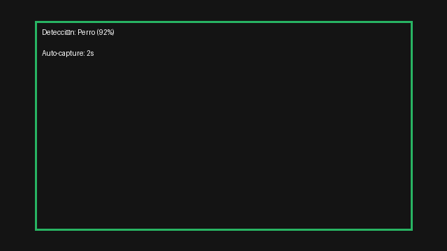
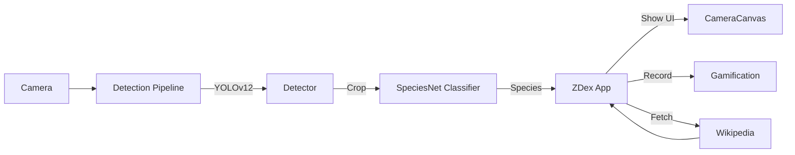

- https://github.com/google/cameratrapai
- https://www.kaggle.com/models/google/speciesnet
 
 [](https://github.com/crismoraga/PDI_v2/releases)
 [](LICENSE)
 [](https://github.com/crismoraga/PDI_v2/actions)

# ZDex — Enciclopedia Animal en Tiempo Real (Enterprise-grade)

ZDex transforma detección de fauna en una experiencia gamificada y verificable para investigaciones, educación y proyectos de conservación. Este README está pensado como un manual riguroso y profesional para desarrolladores, integradores y operadores.

Key highlights:
- Fast detection with YOLOv12 + SpeciesNet classification
- Gamified Pokédex experience with achievements and location analytics
- Automatic IP-based geolocation
- High-confidence view freeze and curated "New Species Found" workflows
 - High-confidence view freeze and curated "New Species Found" workflows (configurable via `config.FREEZE_CONFIDENCE_THRESHOLD`)
- Extensible: add assets, animations & advanced Wikipedia enrichment
 - Extensible: add assets, animations & advanced Wikipedia enrichment (Wikidata-backed)

## Demo



---

## Architecture

Mermaid flow (rendered on GitHub):



Architecture notes:
- The detection `PIPELINE` decouples frame acquisition from inference and puts results into a queue for the UI thread.
- High-confidence events (>=90%) freeze updates and present a focal view + stationary info card.
 - Wikipedia + Wikidata integration: we fetch summaries from Wikipedia and then query Wikidata via SPARQL to extract structured fields (e.g., habitat and diet) where available, giving a more accurate, structured view than free-text heuristics.

---

## Quickstart (developer)
1. Clone
```powershell
git clone https://github.com/crismoraga/PDI_v2.git
cd PDI_v2
```
2. Create environment and install packages
```powershell
python -m venv .venv
conda create -n zdex python=3.10  # optional conda
pip install -r requirements.txt
```
3. Generate assets (optional):
```powershell
python tools/generate_celebration_gif.py  # create assets/ui/celebration.gif
python tools/generate_demo_gif.py  # create assets/ui/demo_gif.gif for README/demo
```
4. Run
```powershell
python run_zdex.py
```

---

## Enterprise features
- Logging & observability via built-in logging (INFO/DEBUG/ERROR). Integrate with ELK or Azure Application Insights by replacing the Python logger sink.
- CI/CD: Add `ci.yml` to run `pytest` and `flake8` and `mypy` for type checks.
- Docker: We include Dockerfiles under `/yolov12/docker/` to support reproducible builds.
- GPU support: Torch + DirectML for Windows AMD or CUDA for NVIDIA devices.

### Security & Data protection
- Images captured to `data/captures/` may contain PII — configure retention and redaction policies.
- When used in field research, use device-managed encryption to protect data.

---

## Documentation & How to contribute
- Add missing species to `full_image_...labels.txt`
- Create new achievements in `zdex/gamification.py`
- To reproduce demo GIF: run `tools/generate_demo_gif.py` and commit the output to `assets/ui/`

---

For full Spanish documentation visit `README_ES.md`.