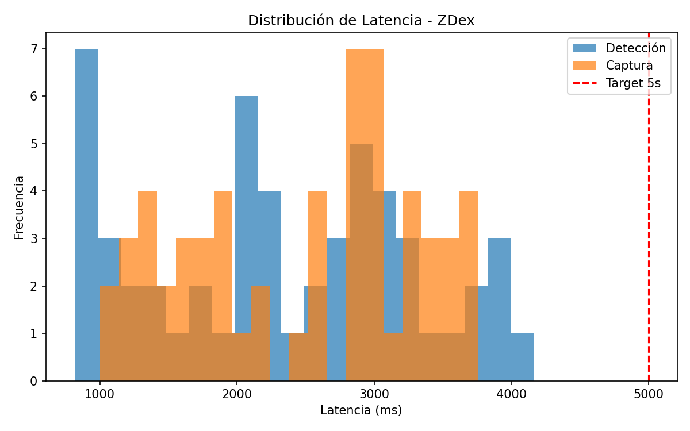
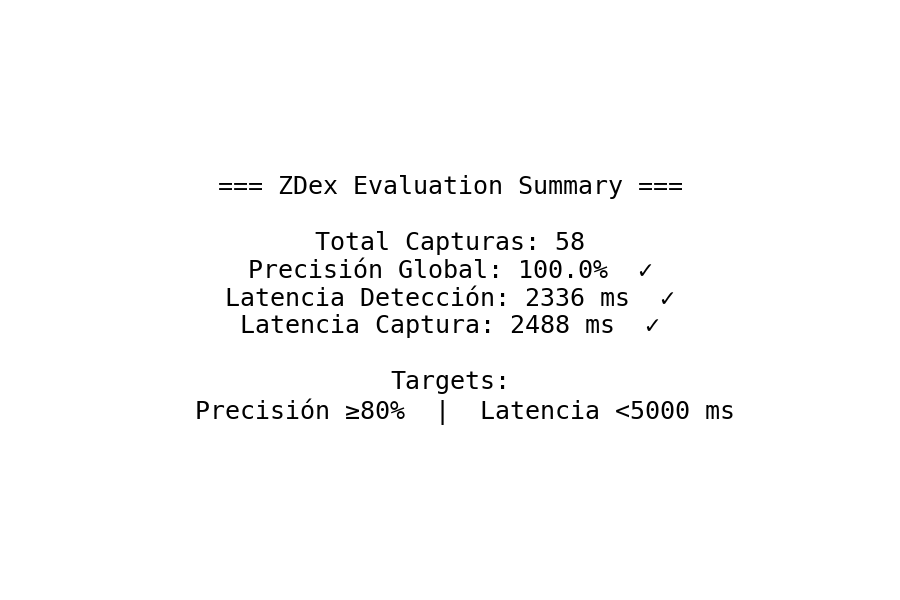

# ZDex — Pokédex de Animales en Tiempo Real

[](LICENSE)
[](https://www.python.org/)
[](https://youtu.be/MNIEpdeGOdA)
[](https://github.com/sunsmarterjie/yolov12)
[](https://www.kaggle.com/models/google/speciesnet/keras/v4.0.0b)
[](#evaluacion-y-metricas)
[](https://github.com/crismoraga/PDI_v2/actions/workflows/evaluate.yml)
[](https://pytorch.org/)
[](https://opencv.org/)
[](https://github.com/ultralytics)

[](https://youtu.be/MNIEpdeGOdA)

> ZDex es una aplicación para detectar y clasificar animales en tiempo real, registrar capturas verificadas y generar métricas para evaluación científica y académica, con componentes de gamificación para un uso más cercano y lúdico.

---

## Índice

- [ZDex — Pokédex de Animales en Tiempo Real](#zdex--pokédex-de-animales-en-tiempo-real)
  - [Índice](#índice)
  - [Resumen](#resumen)
  - [Caracteristicas](#caracteristicas)
  - [Arquitectura \& Componentes](#arquitectura--componentes)
    - [Componentes (flujo de datos)](#componentes-flujo-de-datos)
    - [Esquema de datos (eventos JSONL)](#esquema-de-datos-eventos-jsonl)
  - [Resultados actuales (muestra)](#resultados-actuales-muestra)
  - [Evidencias generadas (gráficos sample)](#evidencias-generadas-gráficos-sample)
  - [Instalacion y Ejecucion Rapida](#instalacion-y-ejecucion-rapida)
  - [Evaluacion y metricas](#evaluacion-y-metricas)
    - [Recolectar datos reales para evaluación](#recolectar-datos-reales-para-evaluación)
  - [Evidencias y Graficos](#evidencias-y-graficos)
  - [Benchmark \& Resultados (muestra)](#benchmark--resultados-muestra)
  - [Limitaciones y advertencias](#limitaciones-y-advertencias)
  - [Roadmap y próximos pasos](#roadmap-y-próximos-pasos)
  - [Glosario (términos clave)](#glosario-términos-clave)
  - [Estructura del proyecto](#estructura-del-proyecto)
  - [Desarrollo, Pruebas y CI](#desarrollo-pruebas-y-ci)
  - [Cómo contribuir](#cómo-contribuir)
    - [Añadir nuevas especies / etiquetas](#añadir-nuevas-especies--etiquetas)
  - [Citas y Agradecimientos](#citas-y-agradecimientos)

---

## Resumen

ZDex combina YOLOv12 y SpeciesNet para ofrecer:

- Detección de animales (frames de cámara) con YOLOv12.
- Clasificación por especie con SpeciesNet.
- Interfaz de captura (manual y auto-captura), histórial y gamificación.
- Registro de métricas en `data/metrics/events.jsonl` y herramientas para generar informes reproducibles.

Permite generar evidencia cuantitativa para validar objetivos: precisión (Top-1) y latencia end-to-end.

---

## Caracteristicas

- Soporte de detección en tiempo real con YOLOv12 (clases COCO enfocadas a fauna).
- Clasificador SpeciesNet (modelo base incluido o descargable desde Kaggle).
- UI (Tkinter) con pokédex, panel de especie, contador y auto-captura (configurable).
- Registro persistente de captures y estadísticas (`data/captures.json`, `data/stats.json`).
- Logging de métricas (JSONL) y análisis reproducible (`metrics_report.py`, `seed_metrics.py`).

---

## Arquitectura & Componentes

Arquitectura de alto nivel:

```mermaid
flowchart LR
  %% Subgraphs to improve readability
  subgraph CAPTURE [Captura]
    Camera([Cámara / Frame]) --> Pipeline[Pipeline de detección]
  end

  subgraph INFERENCE [Inferencia]
    Pipeline --> Detector[YOLOv12]
    Detector --> Classifier[SpeciesNet]
  end

  subgraph UI [Interfaz]
    Classifier --> App[[App (Tkinter)]]
    App --> Store[(Almacenamiento de capturas)]
  end

  subgraph METRICS [Métricas]
    Pipeline --> Metrics{{Metrics Logger}}
    Metrics --> Events[[events.jsonl]]
  end

  %% Styling
  classDef captureStyle fill:#f9f,stroke:#333,stroke-width:1px;
  classDef infraStyle fill:#9ff,stroke:#333,stroke-width:1px;
  classDef uiStyle fill:#ff9,stroke:#333,stroke-width:1px;
  classDef metricsStyle fill:#9f9,stroke:#333,stroke-width:1px;

  class Camera,Pipeline captureStyle;
  class Detector,Classifier infraStyle;
  class App,Store uiStyle;
  class Metrics,Events metricsStyle;
```

Archivos clave:
 
### Componentes (flujo de datos)

- `camera.py` (captura): obtiene frames desde cámara (OpenCV) y crea paquetes de frame para la pipeline.
- `pipeline.py` (orquestador): recibe frames, ejecuta detección (YOLOv12), invoca el clasificador (SpeciesNet), mide latencias y emite eventos hacia `zdex/metrics`.
- `detector.py`: encapsula la inferencia del detector y pre/postprocesamiento, devuelve bounding boxes y clases candidatas.
- `app.py` (UI): muestra resultados, permite correcciones, captura manual/auto y registra capturas en `data/captures.json`.
- `metrics.py` (logger): escribe `events.jsonl` con estructura consistente entre detección, captura y latencia.

### Esquema de datos (eventos JSONL)

El archivo `data/metrics/events.jsonl` contiene eventos con campos (ejemplo parcial):

- `event`: detection | capture | latency
- `timestamp`: epoch UTC
- `species_name` / `predicted_name` / `ground_truth_name`
- `detection_confidence` / `classification_score`
- `latency_ms`: latencia medida en milisegundos
- `bbox_area`, `detections_in_frame` (opcional)

Este esquema permite calcular métricas de precisión (Top-1), latencias y generar gráficos reproducibles.


- `zdex/` — código fuente principal: `app.py`, `pipeline.py`, `detector.py`, `metrics.py`.
- `data/` — capturas, estadísticas y métricas.
- `yolov12/` — repo / utilidades del detector (referencia: [YOLOv12](https://github.com/sunsmarterjie/yolov12)).
-- Modelos: `models/` y descargables automáticos (Detector: YOLOv12, Classifier: SpeciesNet).

---

---

## Resultados actuales (muestra)

Estos resultados provienen de una ejecución de ejemplo con datos semilla (script `zdex/seed_metrics.py`). Para reproducir localmente, ejecute `python -m zdex.seed_metrics` y `python -m zdex.metrics_report --charts`.

Resumen numérico (sample):

| Métrica | Valor (sample) |
|---|---:|
| Detecciones totales (events detection) | 54 |
| Capturas totales (events capture) | 58 |
| Precisión Top-1 (global) | 100% |
| Latencia inferencia (media) | 2.336 s |
| Latencia inferencia (mediana) | 2.310 s |
| Latencia inferencia (p95) | 3.959 s |
| Latencia captura (media) | 2.488 s |
| Latencia captura (mediana) | 2.739 s |
| Latencia captura (p95) | 3.725 s |

Precisión por especie (sample):

| Especie | Count | Accuracy |
|---|---:|---:|
| domestic cat | 18 | 100% |
| giraffe | 8 | 100% |
| mountain goat | 8 | 100% |
| brown bear | 6 | 100% |
| human | 4 | 100% |
| domestic dog | 4 | 100% |
| others | 10 | 100% |

Resumen JSON: `data/metrics/evaluation_summary.json` (generado con `python -m zdex.metrics_summary`).

---

## Evidencias generadas (gráficos sample)

Los gráficos se generan con `zdex/metrics_report.py --charts` y se colocan en `data/metrics/charts`.


_Histograma de latencias (inferencia)_


_Precisión Top-1 por especie (muestra)_


_Resumen ejecutivo (sample)_

Interpretación breve de los gráficos:

- Histograma de latencias: muestra la distribución de latencias de inferencia por frame; ver P95 para SLO.
- Precisión por especie: barra por especie con el porcentaje de captures correctas (Top-1) — útil para identificar sesgos.
- Resumen ejecutivo: tarjeta visual con las métricas clave y resumen de artefactos.


## Instalacion y Ejecucion Rapida

```pwsh
git clone https://github.com/crismoraga/PDI_v2.git
cd PDI_v2
pip install -r yolov12/requirements.txt
pip install -r zdex/requirements.txt
```

Para ejecutar la aplicación:

```pwsh
python run_zdex.py
```

Probar el detector sin cámara:

```bash
python test_detection.py
```

---

## Evaluacion y metricas

ZDex soporta un flujo de evaluación reproducible:

- Guardar eventos de detección/captura en `data/metrics/events.jsonl`.
- Generar gráficos y resumen con `zdex/metrics_report.py`.
- Analizar en detalle con `evaluation_notebook.ipynb`.

Tipos de eventos:

- `detection`: latencia de inferencia, número de detecciones, bounding boxes, scores
- `capture`: captura, predicted_name, ground_truth_name, correct, detection_confidence, classification_score, latency_ms, location, auto_capture
- `latency`: muestras puntuales por etapa

Comandos de ayuda:

```pwsh
python -m zdex.seed_metrics            # Poblar métricas con datos de ejemplo (demo/CI)
python -m zdex.metrics_report --charts # Resumen y gráficos PNG en data/metrics/charts/
```

Para exportar resultados y evidencia a JSON/PNG ver `evaluation_notebook.ipynb`.

---

### Recolectar datos reales para evaluación

Para una evaluación robusta con datos reales:

1. Configure la cámara y el entorno (iluminación, resolución).
2. Ejecute la aplicación `python run_zdex.py`.
3. Active _auto-capture_ y/o capture manual cuando obtenga detecciones relevantes.
4. Confirme la especie cuando se solicite (ground truth) para mejorar la calidad del dataset.
5. Ejecute `python -m zdex.metrics_report --charts` y revise `data/metrics/charts` para evidencia y `data/metrics/evaluation_summary.json` para resumen.

Consejos para validación:

- Capture múltiples sesiones y escenarios para evitar sesgos por ubicación, hora o ángulo.
- Recolecte al menos N ≥ 30-50 muestras por especie objetivo para tener métricas con alguna estabilidad.
- Registre metadata de captura (localización, condiciones) si desea filtrar los resultados por contexto.


## Evidencias y Graficos

Se generan PNG con `--charts` en `data/metrics/charts/`. Ejemplos:

- `latency_histogram.png` — histograma latencias
- `accuracy_by_species.png` — barras de precisión por especie
- `summary_card.png` — resumen ejecutivo visual

Si existen, se renderizan más arriba en la sección; ejecute el script para regenerarlos con datos reales.

---

## Benchmark & Resultados (muestra)

Los números mostrados en las pruebas iniciales con datos semilla resultaron en:

## Limitaciones y advertencias

- Los datos de ejemplo generados por `zdex/seed_metrics.py` son sintéticos o muestreados y **no** representan un benchmark final de producción.
- Para mediciones precisas de latencia y throughput, recomendamos ejecutar la inferencia en el hardware objetivo (GPU o acelerador) y medir con varias corridas para obtener p95.
- Para producción, convierta modelos a ONNX o TensorRT ahí donde sea posible, y compruebe la validez de la clasificación con un dataset de validación separado.
- Actualmente, la interfaz de capturas pregunta al usuario por la corrección (ground truth); en casos de sesiones largas puede ajustarse a modos completamente automáticos con validación offline.

## Roadmap y próximos pasos

- Integrar pipelines CI más complejas (publicar reportes en PRs, usar GitHub Pages para evidencias).
- Añadir tests de integración end-to-end y métricas de regresión visuales (compare charts entre commits).
- Añadir perfiles de hardware y una tabla de comparativa (CPU/GPU/Jetson/ONNX) en la documentación.
- Recolectar datasets reales y añadir scripts de evaluación comparativa reproducible.

## Glosario (términos clave)

- Latencia E2E (End-to-end): tiempo desde captura del frame hasta la finalización de la inferencia y registro.
- Precisión Top-1: porcentaje de capturas en las que la especie correcta fue la predicha como top-1 por el modelo.
- Auto-capture: modo del UI que captura automáticamente cuando una detección supera umbrales configurables.
- Ground truth: la etiqueta manualmente verificada por el usuario para una captura.


| Métrica | Valor (sample) | Target |
|---|---:|:---|
| Latencia inferencia (promedio) | ~2.3 s | < 5 s |
| Latencia captura (promedio) | ~2.5 s | < 5 s |
| Precisión Top-1 (global) | 100% (seeded) | ≥ 80% |

> Notas: Estos son datos de ejemplo generados por `seed_metrics.py`. Recomendamos recolectar evidencias reales para un informe definitivo.

---

## Estructura del proyecto

```text
PDI_v2/
├── zdex/                   # App (pipeline, UI, metrics, tools)
├── data/                   # captures, stats, metrics
├── models/                 # models (detector/classifier)
├── yolov12/                # detector helper / requirements
├── evaluation_notebook.ipynb
├── EVALUATION.md
├── ENTREGABLE_EVALUACION.md
└── README.md
```

---

## Desarrollo, Pruebas y CI


Pautas generales:

- Añada tests unitarios y de integración.
- Use entornos reproducibles (venv/conda) y fije versiones.
- Genere artefactos en CI para evidencias (gráficos, JSON summary).

Comandos útiles para reproducir localmente:

```pwsh
python -m zdex.seed_metrics
python -m zdex.metrics_report --charts
python -m zdex.metrics_summary > data/metrics/evaluation_summary.json
```

CI básico (GitHub Actions): hemos incluido el workflow [`.github/workflows/evaluate.yml`](.github/workflows/evaluate.yml) que ejecuta:

1. Instala dependencias.
2. Ejecuta `zdex.seed_metrics` para generar datos demo.
3. Ejecuta `zdex.metrics_report --charts` y `zdex.metrics_summary`.
4. Ejecuta tests opcionales (`pytest`).
5. Publica artefactos (carpeta charts y `evaluation_summary.json`).

Si desea, edite el workflow para integrarlo con su proceso de despliegue o publicar resultados a GitHub Pages u otro servicio.

---

## Cómo contribuir

1. Fork & branch
2. Añadir tests y documentación
3. Abrir PR con descripción y métricas de rendimiento (si aplica)

### Añadir nuevas especies / etiquetas

1. Abra `taxonomy_release.txt` y añada la nueva especie siguiendo el formato existente.
2. Si es necesario, actualice los modelos (SpeciesNet) o proporcione un fichero de mapping entre IDs y nombres de especie.
3. Añada test/smoke tests que verifiquen que la etiqueta se reconoce en el pipeline.


---

## Citas y Agradecimientos

Este proyecto se basa en:

- YOLOv12 (sunsmarterjie): [https://github.com/sunsmarterjie/yolov12](https://github.com/sunsmarterjie/yolov12)
- SpeciesNet (Google / Kaggle): [https://www.kaggle.com/models/google/speciesnet/keras/v4.0.0b](https://www.kaggle.com/models/google/speciesnet/keras/v4.0.0b)
