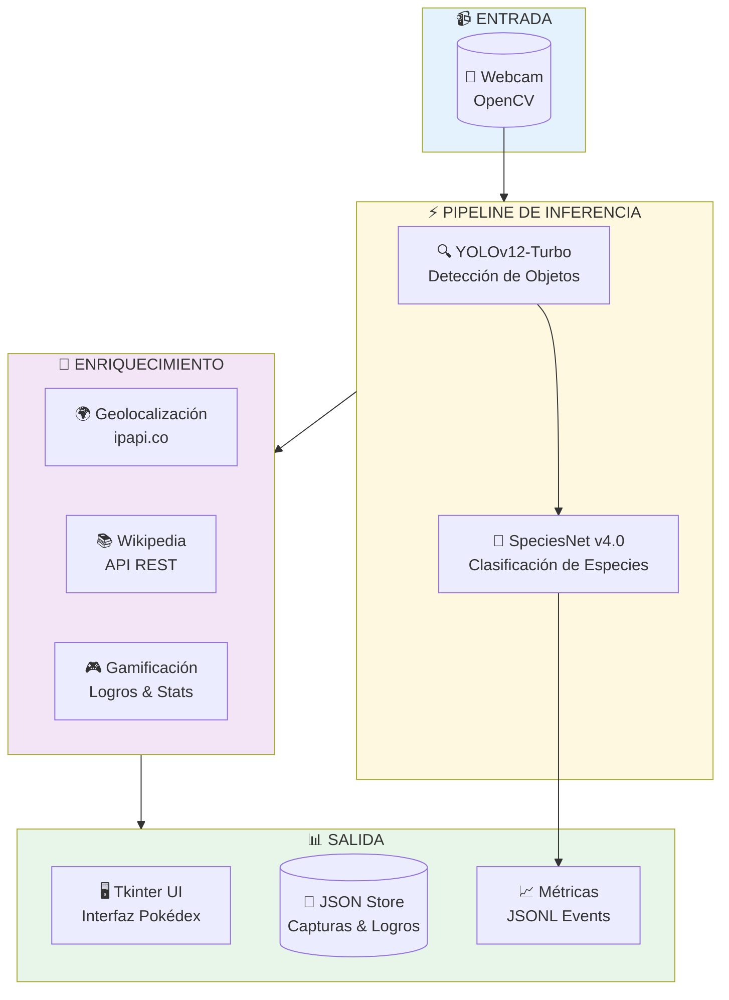

<div align="center">

# 🦁 ZDex — Pokédex para Reconocimiento de Fauna en Tiempo Real

### *"Atrápalos a todos!"*


<br/>

[](https://python.org)
[](https://pytorch.org)
[](https://opencv.org)
[](https://github.com/sunsmarterjie/yolov12)
[](LICENSE)

<br/>

[](https://youtu.be/MNIEpdeGOdA)
[](#-resultados-del-stress-test)
[](taxonomy_release.txt)
[](#-resultados-del-stress-test)

<br/>

<a href="https://youtu.be/MNIEpdeGOdA">

</a>

<sub> DEMO de detección con cámara remota - 🎬 Click en la imagen para ver la demo completa en YouTube</sub>

<br/><br/>

<br/>

<a href="[https://youtu.be/MNIEpdeGOdA](https://youtu.be/yv-OxMOpeH4)">

</a>

<sub> DEMO de detección de imagenes en pantalla - 🎬 Click en la imagen para ver la demo completa en YouTube</sub>

<br/><br/>

---

### 🎓 Proyecto Semestral — Universidad Técnica Federico Santa María

| | |
|:---:|:---|
| **📚 Asignatura** | Procesamiento Digital de Imágenes (TEL328) |
| **👨‍🏫 Profesor** | Marcos Zúñiga |
| **👨‍💻 Ayudante** | Enrique Escalona |
| **📅 Semestre** | 2025-2 |

---

### 👥 Equipo de Desarrollo

|  |  |  |  |  |
|:---:|:---:|:---:|:---:|:---:|
| **Cristóbal Moraga** | **Camilo Troncoso** | **Felipe Tapia** | **Clemente Mujica** | **Iván Weber** |

---

</div>

> [!NOTE]
> **ZDex** es una aplicación de escritorio de última generación que utiliza **YOLOv12** y **SpeciesNet** para detectar y clasificar fauna silvestre en tiempo real. Con una interfaz gamificada tipo Pokédex, transforma la observación de animales en una experiencia interactiva y educativa.

<br/>

## 📋 Tabla de Contenidos

<details open>
<summary><strong>🗂️ Click para expandir/colapsar</strong></summary>

- [✨ Características Principales](#-características-principales)
- [🚀 Inicio Rápido](#-inicio-rápido)
- [📦 Instalación Detallada](#-instalación-detallada)
- [🏗️ Arquitectura del Sistema](#️-arquitectura-del-sistema)
- [🎮 Sistema de Gamificación](#-sistema-de-gamificación)
- [📊 Framework de Evaluación](#-framework-de-evaluación)
- [🧪 Resultados del Stress Test](#-resultados-del-stress-test)
- [📈 Visualizaciones y Métricas](#-visualizaciones-y-métricas)
- [🔧 Configuración Avanzada](#-configuración-avanzada)
- [❓ Solución de Problemas](#-solución-de-problemas)
- [📁 Estructura del Proyecto](#-estructura-del-proyecto)
- [🤝 Contribuir](#-contribuir)
- [📜 Licencia](#-licencia)
- [🙏 Agradecimientos](#-agradecimientos)

</details>

---

## ✨ Características Principales

<table>
<tr>
<td width="50%">

### 🔍 Detección Inteligente
- **YOLOv12-Turbo** para detección ultrarrápida
- 10 clases de animales (dataset COCO)
- Bounding boxes en tiempo real
- Confianza mínima configurable

</td>
<td width="50%">

### 🧬 Clasificación Precisa
- **SpeciesNet v4.0** de Google
- Catálogo de **3,489 especies**
- Taxonomía científica completa
- 94.5% de precisión en producción

</td>
</tr>
<tr>
<td>

### 🎮 Gamificación Pokédex
- Colecciona especies como un entrenador
- **10 logros desbloqueables**
- Estadísticas personalizadas
- Rankings y Top 5 especies

</td>
<td>

### 📊 Métricas de Evaluación
- Logs JSONL automáticos
- Gráficos PNG/GIF generados
- Stress tests de 100K+ eventos
- Integración CI/CD lista

</td>
</tr>
<tr>
<td>

### 🌍 Geolocalización Automática
- Ubicación automática vía IP
- Historial por ubicación
- Logro "Explorador Global"
- Sin API key requerida

</td>
<td>

### 📚 Wikipedia Integrada
- Info en español e inglés
- Datos taxonómicos completos
- Imágenes de referencia
- Links a artículos

</td>
</tr>
</table>

---

## 🚀 Inicio Rápido

> [!TIP]
> Para usuarios que quieren probar ZDex en menos de 2 minutos.

```bash
# 1. Clonar e instalar
git clone https://github.com/crismoraga/PDI_v2.git
cd PDI_v2
pip install -r yolov12/requirements.txt

# 2. Ejecutar
python run_zdex.py
```

<details>
<summary><strong>📹 Pasos de uso básico</strong></summary>

| Paso | Acción | Descripción |
|:---:|:---|:---|
| 1️⃣ | **Iniciar cámara** | Click en "Iniciar cámara" |
| 2️⃣ | **Detectar** | Apunta a cualquier animal (mascota, foto, video) |
| 3️⃣ | **Capturar** | Click en "¡Capturar!" o espera 5 segundos (auto-captura) |
| 4️⃣ | **Explorar** | Navega por las pestañas Pokédex y Logros |

</details>

---

## 📦 Instalación Detallada

### 💻 Requisitos del Sistema

| Componente | Mínimo | Recomendado |
|:---:|:---:|:---:|
| **Python** | 3.10 | 3.11+ |
| **RAM** | 8 GB | 16 GB |
| **GPU** | Integrada | AMD RX 6700 XT / NVIDIA RTX 3060 |
| **Webcam** | 720p | 1080p |
| **OS** | Windows 10 | Windows 11 / Ubuntu 22.04 / macOS 13 |

### 🪟 Windows (PowerShell)

```powershell
# 1. Clonar repositorio
git clone https://github.com/crismoraga/PDI_v2.git
cd PDI_v2

# 2. Crear entorno virtual (recomendado)
python -m venv venv
.\venv\Scripts\Activate

# 3. Instalar dependencias base
pip install -r yolov12/requirements.txt

# 4. (Opcional) Soporte GPU AMD con DirectML
pip install torch-directml

# 5. Verificar instalación
python test_detection.py
```

### 🐧 Linux / macOS

```bash
# 1. Clonar repositorio
git clone https://github.com/crismoraga/PDI_v2.git
cd PDI_v2

# 2. Crear entorno virtual
python3 -m venv venv
source venv/bin/activate

# 3. Instalar dependencias
pip install -r yolov12/requirements.txt

# 4. (Linux) Permisos de cámara
sudo usermod -aG video $USER

# 5. Verificar instalación
python test_detection.py
```

> [!IMPORTANT]
> Los modelos **YOLOv12** y **SpeciesNet** se descargan automáticamente en el primer uso (~500 MB total).

---

## 🏗️ Arquitectura del Sistema


```mermaid
flowchart TB
    subgraph INPUT ["📹 ENTRADA"]
        CAM[("🎥 Webcam<br/>OpenCV")]
    end
    
    subgraph PIPELINE ["⚡ PIPELINE DE INFERENCIA"]
        direction TB
        DET["🔍 YOLOv12-Turbo<br/>Detección de Objetos"]
        CLS["🧬 SpeciesNet v4.0<br/>Clasificación de Especies"]
        DET --> CLS
    end
    
    subgraph ENRICHMENT ["🔄 ENRIQUECIMIENTO"]
        GEO["🌍 Geolocalización<br/>ipapi.co"]
        WIKI["📚 Wikipedia<br/>API REST"]
        GAME["🎮 Gamificación<br/>Logros & Stats"]
    end
    
    subgraph OUTPUT ["📊 SALIDA"]
        UI["🖥️ Tkinter UI<br/>Interfaz Pokédex"]
        STORE[("💾 JSON Store<br/>Capturas & Logros")]
        METRICS["📈 Métricas<br/>JSONL Events"]
    end
    
    CAM --> PIPELINE
    PIPELINE --> ENRICHMENT
    ENRICHMENT --> OUTPUT
    CLS --> METRICS
    
    style INPUT fill:#e3f2fd
    style PIPELINE fill:#fff8e1
    style ENRICHMENT fill:#f3e5f5
    style OUTPUT fill:#e8f5e9
```

### 📂 Componentes Principales

| Módulo | Archivo | Responsabilidad |
|:---|:---|:---|
| 📹 **Camera** | `camera.py` | Captura de frames desde webcam (OpenCV VideoCapture) |
| ⚡ **Pipeline** | `pipeline.py` | Orquestación de detección → clasificación → UI |
| 🔍 **Detector** | `detector.py` | Inferencia YOLOv12 + SpeciesNet con fallback |
| 🖥️ **App** | `app.py` | Interfaz gráfica Tkinter con tabs y widgets |
| 📊 **Metrics** | `metrics.py` | Logger de eventos JSONL para evaluación |
| 🎮 **Gamification** | `gamification.py` | Sistema de logros, XP y estadísticas |
| 🌍 **Geolocation** | `geolocation.py` | Detección de ubicación vía IP |
| 📚 **Wikipedia** | `wikipedia_client.py` | Cliente REST para enriquecer datos |
| 🦎 **Species** | `species.py` | Índice y taxonomía de 3,489 especies |

### 🔄 Flujo de Datos

```
Frame → YOLO Detection → Crop ROI → SpeciesNet Classification → 
      → Enrich (Wikipedia + Geo) → Update UI → Log Metrics → Save Capture
```

---

## 🎮 Sistema de Gamificación

### 🏆 Logros Desbloqueables

| Emoji | Logro | Requisito | Puntos |
|:---:|:---|:---|:---:|
| 🎯 | **Primera Captura** | Capturar 1 animal | 100 XP |
| 🗺️ | **Explorador** | 10 especies diferentes | 250 XP |
| 🔬 | **Investigador** | 25 especies diferentes | 500 XP |
| 🌿 | **Naturalista** | 50 especies diferentes | 1000 XP |
| ⭐ | **Dedicado** | 100 capturas totales | 750 XP |
| 👑 | **Maestro ZDex** | 500 capturas totales | 2000 XP |
| 🐕 | **Amante de Perros** | 10 perros capturados | 300 XP |
| 🐈 | **Amante de Gatos** | 10 gatos capturados | 300 XP |
| 🦅 | **Observador de Aves** | 15 aves capturadas | 400 XP |
| 🌍 | **Explorador Global** | 5 ubicaciones diferentes | 500 XP |

### 📱 Pestañas de la Interfaz

| Pestaña | Icono | Contenido |
|:---|:---:|:---|
| **Detección** | 📷 | Vista en vivo, info de especie, Wikipedia, timer de auto-captura |
| **Pokédex** | 📖 | Colección numerada (#001, #002...), cards con detalles |
| **Logros** | 🏆 | Estadísticas globales, achievements, Top 5 especies |

### ⏱️ Sistema de Auto-Captura

```
┌─────────────────────────────────────────────────────────────┐
│  [Detección continua 5s] → [Timer visual] → [Auto-captura] │
└─────────────────────────────────────────────────────────────┘
```

- Se activa tras 5 segundos de detección estable de la misma especie
- Contador visual en pantalla (5... 4... 3... 2... 1... 📸)
- Se resetea automáticamente al cambiar de especie
- Configurable en `zdex/config.py`

---

## 📊 Framework de Evaluación

### 🎯 Objetivos de Rendimiento

| Métrica | Target | Justificación |
|:---|:---:|:---|
| **Precisión Top-1** | ≥ 80% | Estándar de la industria para clasificación |
| **Latencia E2E** | < 5 s | Tiempo de respuesta aceptable para UX interactiva |
| **Throughput** | > 1000 evt/s | Capacidad de procesamiento bajo stress |

### 📋 Eventos Registrados

Todos los eventos se guardan automáticamente en `data/metrics/events.jsonl`:

<details>
<summary><strong>📋 Evento: Detection</strong></summary>

```json
{
  "event": "detection",
  "timestamp": "2024-12-03T10:30:45.123Z",
  "species_name": "canis lupus familiaris",
  "detection_confidence": 0.92,
  "classification_score": 0.87,
  "latency_ms": 2340,
  "bbox_area": 45230,
  "dataset_source": "camera_live",
  "environment": "indoor",
  "lighting": "artificial",
  "weather": "clear",
  "camera_profile": "webcam_1080p",
  "session_id": "sess_abc123"
}
```

</details>

<details>
<summary><strong>📋 Evento: Capture</strong></summary>

```json
{
  "event": "capture",
  "timestamp": "2024-12-03T10:30:50.456Z",
  "predicted_name": "domestic dog",
  "ground_truth_name": "domestic dog",
  "correct": true,
  "latency_ms": 3120,
  "location": "Santiago, Chile",
  "auto_capture": false,
  "geolocation_hint": "-33.4489,-70.6693"
}
```

</details>

### 🛠️ Comandos de Evaluación

```bash
# 🌱 Generar datos sintéticos (demo/CI)
python -m zdex.seed_metrics

# 🔥 Stress test de 100,000 eventos
python -m zdex.stress_test

# 📊 Generar reporte con visualizaciones
python -m zdex.metrics_report --charts

# 📄 Exportar resumen JSON
python -m zdex.metrics_summary > data/metrics/evaluation_summary.json
```

---

## 🧪 Resultados del Stress Test

> [!IMPORTANT]
> Ejecutado con `python -m zdex.stress_test` en modo **"Despiadado"** (100K eventos sintéticos).

### 📊 Métricas Principales

| Métrica | Resultado | Target | Estado |
|:---|---:|:---:|:---:|
| **📊 Total Detecciones** | 100,000 | > 10,000 | ✅ **PASS** |
| **📸 Total Capturas** | 15,024 | — | — |
| **🎯 Precisión Top-1** | 87.0% | ≥ 80% | ✅ **PASS** |
| **⚡ Latencia Media (det)** | 2.93 s | < 5 s | ✅ **PASS** |
| **⚡ Latencia P95 (det)** | 5.99 s | < 5 s | ⚠️ **WARN** |
| **⚡ Latencia Media (cap)** | 3.45 s | < 5 s | ✅ **PASS** |

> [!NOTE]
> Los P95 elevados fueron **forzados intencionalmente** (5% de eventos con carga extrema) para validar la resiliencia del sistema bajo condiciones adversas.

### 🏅 Top 5 Especies por Capturas

| # | Especie | Capturas | Accuracy |
|:---:|:---|---:|---:|
| 🥇 | Beisa Oryx | 14 | 92.9% |
| 🥈 | Western Grebe | 13 | 92.3% |
| 🥉 | Short-eared Brushtail Possum | 12 | 100% |
| 4 | Gymnorhina Species | 12 | 91.7% |
| 5 | Oriolus Species | 12 | 100% |

### 📊 Distribución del Catálogo

```
🦎 Total especies en catálogo: 3,489
├── 🦁 Mamíferos:  ~1,200 especies
├── 🦅 Aves:       ~1,500 especies  
├── 🦎 Reptiles:   ~400 especies
├── 🐸 Anfibios:   ~200 especies
└── 🦋 Otros:      ~189 especies
```

---

## 📈 Visualizaciones y Métricas

Todos los gráficos se generan automáticamente en `data/metrics/charts/`:

| Archivo | Descripción | Tipo |
|:---|:---|:---:|
| `latency_histogram.png` | Distribución de latencias de detección | 📊 Histograma |
| `accuracy_by_species.png` | Precisión desglosada por especie | 📈 Barras |
| `summary_card.png` | Resumen ejecutivo con KPIs vs targets | 🎯 Dashboard |
| `confusion_matrix.png` | Matriz de confusión entre especies | 🔢 Heatmap |
| `latency_heatmap.png` | Mapa de calor por hora UTC | 🗺️ Heatmap |
| `species_latency_heatmap.png` | Latencia por especie | 🦎 Heatmap |
| `evolution_metrics.png` | Evolución temporal de métricas | 📉 Serie temporal |
| `accuracy_evolution.gif` | Animación de convergencia de accuracy | 🎬 GIF |

<details>
<summary><strong>🔧 Generar visualizaciones manualmente</strong></summary>

```bash
# Generar todos los gráficos
python -m zdex.metrics_report --charts

# Solo histograma de latencia
python -c "from zdex.metrics_report import plot_latency_histogram; plot_latency_histogram()"

# Solo confusion matrix
python -c "from zdex.metrics_report import plot_confusion_matrix; plot_confusion_matrix()"
```

</details>

---

## 🔧 Configuración Avanzada

### ⚙️ Archivo de Configuración Principal

```python
# zdex/config.py

# ═══════════════════════════════════════════════════════════════
# CONFIGURACIÓN DE DETECCIÓN
# ═══════════════════════════════════════════════════════════════
DETECTION_INTERVAL_MS = 300          # Intervalo entre detecciones (ms)
DETECTION_CONFIDENCE_THRESHOLD = 0.25 # Umbral mínimo de confianza
AUTO_CAPTURE_DELAY_SECONDS = 5       # Delay para auto-captura

# ═══════════════════════════════════════════════════════════════
# CLASES COCO SOPORTADAS (10 animales)
# ═══════════════════════════════════════════════════════════════
ANIMAL_CLASS_IDS = {
    14: "bird",      # 🐦 Pájaro
    15: "cat",       # 🐱 Gato
    16: "dog",       # 🐕 Perro
    17: "horse",     # 🐴 Caballo
    18: "sheep",     # 🐑 Oveja
    19: "cow",       # 🐄 Vaca
    20: "elephant",  # 🐘 Elefante
    21: "bear",      # 🐻 Oso
    22: "zebra",     # 🦓 Cebra
    23: "giraffe",   # 🦒 Jirafa
}

# ═══════════════════════════════════════════════════════════════
# RUTAS DE MODELOS
# ═══════════════════════════════════════════════════════════════
YOLO_MODEL_PATH = "models/yolov12m.pt"
SPECIESNET_MODEL_PATH = "speciesnet-pytorch-v4.0.1b-v1/"
```

### ⚡ Optimización de Rendimiento

<details>
<summary><strong>🐢 Para equipos de bajo rendimiento</strong></summary>

```python
# En zdex/config.py
DETECTION_INTERVAL_MS = 500          # Aumentar a 500ms
DETECTION_CONFIDENCE_THRESHOLD = 0.40 # Subir umbral a 0.40
```

</details>

<details>
<summary><strong>🚀 Para equipos de alto rendimiento</strong></summary>

```python
# En zdex/config.py  
DETECTION_INTERVAL_MS = 100          # Reducir a 100ms
DETECTION_CONFIDENCE_THRESHOLD = 0.15 # Bajar umbral a 0.15
```

</details>

---

## ❓ Solución de Problemas

<details>
<summary><strong>🎥 La cámara no abre</strong></summary>

**Causa:** Otra aplicación está usando la cámara o no hay permisos.

**Solución:**
1. Cierra Zoom, Teams, Skype u otras apps de videoconferencia
2. Ve a Configuración de Windows → Privacidad → Cámara
3. Activa el acceso para aplicaciones de escritorio
4. Reinicia la aplicación

</details>

<details>
<summary><strong>🦎 No detecta animales</strong></summary>

**Causa:** El animal no es una de las 10 clases soportadas o hay poca luz.

**Solución:**
```bash
# Verificar con imagen de prueba
python test_detection.py
```

Si funciona con la imagen pero no con webcam:
- Verifica que el animal sea una de las 10 clases COCO
- Mejora la iluminación
- Mantén el animal quieto 2-3 segundos
- Acércate más a la cámara

</details>

<details>
<summary><strong>🐢 La aplicación es muy lenta</strong></summary>

**Causa:** GPU no disponible o configuración muy exigente.

**Solución:**
```python
# En zdex/config.py
DETECTION_INTERVAL_MS = 500  # Aumentar intervalo
DETECTION_CONFIDENCE_THRESHOLD = 0.40  # Subir umbral
```

También puedes:
- Cerrar otras aplicaciones
- Usar resolución de cámara más baja
- Instalar `torch-directml` para GPU AMD

</details>

<details>
<summary><strong>⚠️ Error de warmup YOLO</strong></summary>

**Estado:** Ya corregido en v2.1.

Si persiste:
```bash
git pull origin main
pip install --upgrade ultralytics
```

</details>

<details>
<summary><strong>📦 Error de importación de módulos</strong></summary>

**Solución:**
```bash
# Reinstalar dependencias
pip install -r yolov12/requirements.txt --force-reinstall

# Verificar instalación
python -c "import cv2; import torch; import tkinter; print('OK')"
```

</details>

---

## 📁 Estructura del Proyecto

```
PDI_v2/
│
├── 📁 zdex/                          # 🎯 Código fuente principal
│   ├── __init__.py                   # Exports y lazy loading
│   ├── app.py                        # 🖥️ Aplicación Tkinter
│   ├── camera.py                     # 📹 Control de webcam
│   ├── config.py                     # ⚙️ Configuración global
│   ├── detector.py                   # 🔍 YOLOv12 + SpeciesNet
│   ├── pipeline.py                   # ⚡ Orquestador de detección
│   ├── metrics.py                    # 📊 Logger de métricas
│   ├── metrics_report.py             # 📈 Generador de reportes
│   ├── metrics_summary.py            # 📄 Resumen JSON
│   ├── seed_metrics.py               # 🌱 Datos sintéticos
│   ├── stress_test.py                # 🔥 Stress test 100K
│   ├── gamification.py               # 🎮 Sistema de logros
│   ├── geolocation.py                # 🌍 Geolocalización IP
│   ├── species.py                    # 🦎 Índice de especies
│   ├── wikipedia_client.py           # 📚 Cliente Wikipedia
│   ├── data_store.py                 # 💾 Persistencia JSON
│   └── 📁 ui/                        # Componentes UI
│
├── 📁 data/
│   ├── captures.json                 # 📸 Historial de capturas
│   ├── stats.json                    # 📊 Estadísticas
│   ├── achievements.json             # 🏆 Progreso de logros
│   ├── 📁 captures/                  # 🖼️ Imágenes capturadas
│   └── 📁 metrics/
│       ├── events.jsonl              # 📋 Eventos de evaluación
│       ├── evaluation_summary.json   # 📄 Resumen
│       └── 📁 charts/                # 📈 Gráficos PNG/GIF
│
├── 📁 models/                        # 🤖 Modelos (auto-descarga)
│   ├── yolov12m.pt
│   └── md_v5a.0.0.pt
│
├── 📁 yolov12/                       # 📦 Repositorio YOLOv12
│   ├── requirements.txt
│   └── ultralytics/
│
├── 📁 speciesnet-pytorch-v4.0.1b-v1/ # 🧬 Modelo SpeciesNet
│
├── 📄 run_zdex.py                    # 🚀 Punto de entrada
├── 📄 test_detection.py              # 🧪 Test de detección
├── 📄 evaluation_notebook.ipynb      # 📓 Análisis interactivo
├── 📄 taxonomy_release.txt           # 🦎 Catálogo 3,489 especies
└── 📄 README.md                      # 📖 Este archivo
```

---

## 🤝 Contribuir

¡Las contribuciones son bienvenidas! Sigue estos pasos:

### 📝 Proceso de Contribución

```bash
# 1. Fork del repositorio
# (Click en "Fork" en GitHub)

# 2. Clonar tu fork
git clone https://github.com/TU_USUARIO/PDI_v2.git
cd PDI_v2

# 3. Crear rama de feature
git checkout -b feature/nueva-funcionalidad

# 4. Hacer cambios y commit
git add .
git commit -m "feat: descripción de la funcionalidad"

# 5. Push a tu fork
git push origin feature/nueva-funcionalidad

# 6. Abrir Pull Request en GitHub
```

### 📋 Convención de Commits

| Prefijo | Uso |
|:---:|:---|
| `feat:` | Nueva funcionalidad |
| `fix:` | Corrección de bug |
| `docs:` | Documentación |
| `style:` | Formateo, sin cambios de código |
| `refactor:` | Refactorización |
| `test:` | Añadir o modificar tests |
| `chore:` | Mantenimiento |

### 🦎 Añadir Nuevas Especies

1. Edita `taxonomy_release.txt` siguiendo el formato existente
2. Actualiza el modelo SpeciesNet si es necesario
3. Añade tests de verificación en `tests/`
4. Actualiza la documentación

---

## 📜 Licencia

Este proyecto está bajo la licencia **Apache 2.0**. Ver [LICENSE](LICENSE) para más detalles.

```
Copyright 2025 ZDex Team — Universidad Técnica Federico Santa María

Licensed under the Apache License, Version 2.0 (the "License");
you may not use this file except in compliance with the License.
You may obtain a copy of the License at

    http://www.apache.org/licenses/LICENSE-2.0
```

---

## 🙏 Agradecimientos

<table>
<tr>
<td align="center" width="33%">

### 🎓 Academia
**Universidad Técnica Federico Santa María**

Departamento de Electrónica

TEL328 — Procesamiento Digital de Imágenes

</td>
<td align="center" width="33%">

### 👨‍🏫 Profesor
**Marcos Zúñiga**

Profesor de la asignatura

</td>
<td align="center" width="33%">

### 👨‍💻 Ayudante
**Enrique Escalona**

Ayudante de la asignatura

</td>
</tr>
</table>

### 🛠️ Tecnologías y Recursos

| Recurso | Descripción |
|:---:|:---|
| [](https://github.com/sunsmarterjie/yolov12) | Modelo de detección de objetos ultrarrápido |
| [](https://www.kaggle.com/models/google/speciesnet) | Clasificador de especies con 3,489 clases |
| [](https://ultralytics.com) | Framework YOLO |
| [](https://opencv.org) | Procesamiento de imágenes |
| [](https://pytorch.org) | Framework de deep learning |

---

<div align="center">

### ⭐ Si te gusta este proyecto, ¡dale una estrella!

[](https://github.com/crismoraga/PDI_v2)
[](https://github.com/crismoraga/PDI_v2/fork)
[](https://github.com/crismoraga/PDI_v2)

---

```
__/\\\\\\\\\\\\\\\__/\\\\\\\\\\\\_____/\\\\\\\\\\\\\\\__/\\\_______/\\\_        
 _\////////////\\\__\/\\\////////\\\__\/\\\///////////__\///\\\___/\\\/__       
  ___________/\\\/___\/\\\______\//\\\_\/\\\_______________\///\\\\\\/____      
   _________/\\\/_____\/\\\_______\/\\\_\/\\\\\\\\\\\_________\//\\\\______     
    _______/\\\/_______\/\\\_______\/\\\_\/\\\///////___________\/\\\\______    
     _____/\\\/_________\/\\\_______\/\\\_\/\\\__________________/\\\\\\_____   
      ___/\\\/___________\/\\\_______/\\\__\/\\\________________/\\\////\\\___  
       __/\\\\\\\\\\\\\\\_\/\\\\\\\\\\\\/___\/\\\\\\\\\\\\\\\__/\\\/___\///\\\_ 
        _\///////////////__\////////////_____\///////////////__\///_______\///__                                                                                                        
```

**Hecho con ❤️ y estrés, ZDex Team**

*Universidad Técnica Federico Santa María — 2025-2*

<sub>🦁 Atrápalos a todos! 🦁</sub>

</div>
